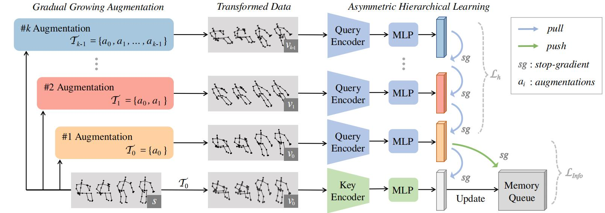

# HiCLR

This is an official PyTorch implementation of [**"Hierarchical Consistent Contrastive Learning for Skeleton-Based Action Recognition with Growing Augmentations"**](https://arxiv.org/abs/2211.13466) in *AAAI 2023*. 



## Requirements
      


## Data Preparation
- Download the raw data of [NTU RGB+D](https://github.com/shahroudy/NTURGB-D) and [PKU-MMD](https://www.icst.pku.edu.cn/struct/Projects/PKUMMD.html).
- For NTU RGB+D dataset, preprocess data with `tools/ntu_gendata.py`. For PKU-MMD dataset, preprocess data with `tools/pku_part1_gendata.py`.
- Then downsample the data to 50 frames with `feeder/preprocess_ntu.py` and `feeder/preprocess_pku.py`.

## Train the Model
See the run_cs.sh for the detailed instructions.

You can change the settings in the corresponding `.yaml` file. 

```bash
# train on NTU RGB+D xsub joint stream
$ python main.py pretrain_hiclr --config config/release/gcn_ntu60/pretext/pretext_hiclr_xsub_joint.yaml
#linear evaluation on NTU RGB+D xsub joint stream
$ python main.py linear_evaluation --config config/release/gcn_ntu60/linear_eval/linear_eval_hiclr_xsub_joint.yaml

#finetune on NTU RGB+D xsub joint stream
$ python main.py finetune_evaluation --config config/release/gcn_ntu60/finetune/xsub_joint.yaml
```
Similarly, set the config as the `.yaml` file in `config/transformer_ntu60/` if you want to train a Transformaer-based model.

## Results and Pre-trained Models
For three-streams results, we use the code in ensemble_xxx.py to obtain the fusion results.
The performance of the released repo is slightly better than that reported in the paper.
You can find the pre-trained model weights [here](https://drive.google.com/drive/folders/1xi4EgygteeLY1-9JIWIPcm-pYpoY7JTa?usp=share_link) (for GCN).

|     Model     | NTU 60 xsub (%) |
| :-----------: | :-------------: |
| HiCLR-joint  |      77.30      |
| HiCLR-motion |      70.29      |
|  HiCLR-bone  |      75.59      |
|   3s-HiCLR   |    **80.94**    |

## Citation
If you find this repository useful, please consider citing our paper:
```
@article{zhang2022s,
    title={Hierarchical Consistent Contrastive Learning for Skeleton-Based Action Recognition with Growing Augmentations},
    author={Zhang, Jiahang and Lin, Lilang and Liu, Jiaying},
    journal={arXiv preprint arXiv:2211.13466},
    year={2022},
}
```

## Acknowledgement
We sincerely thank the authors for releasing the code of their valuable works. Our code is built based on the following repos.
- The code of our framework is heavily based on [AimCLR](https://github.com/Levigty/AimCLR).
- The code of encoder is based on [ST-GCN](https://github.com/yysijie/st-gcn/blob/master/OLD_README.md) and [DSTA-Net](https://github.com/lshiwjx/DSTA-Net).

## Licence

This project is licensed under the terms of the MIT license.
